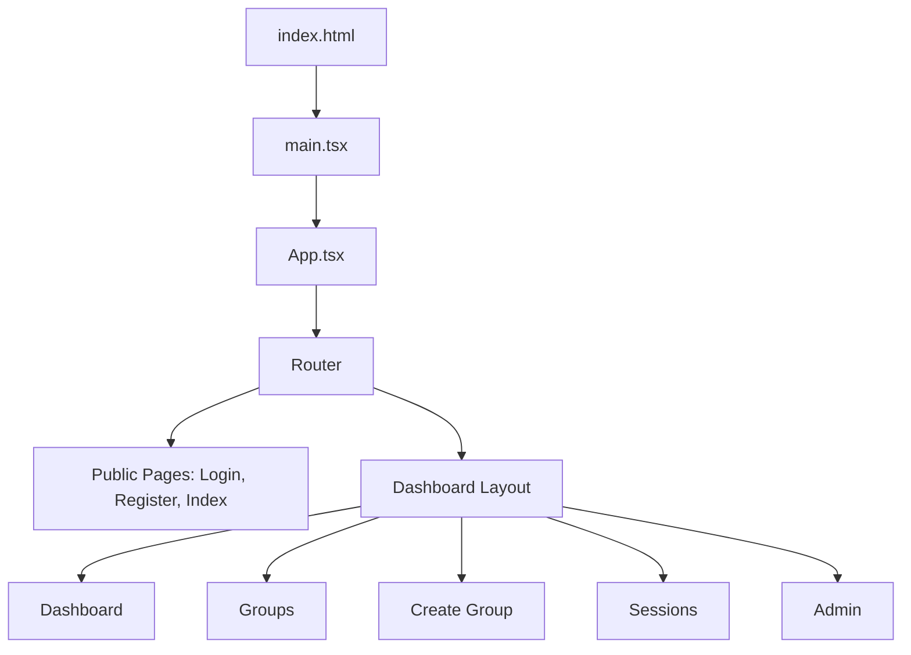
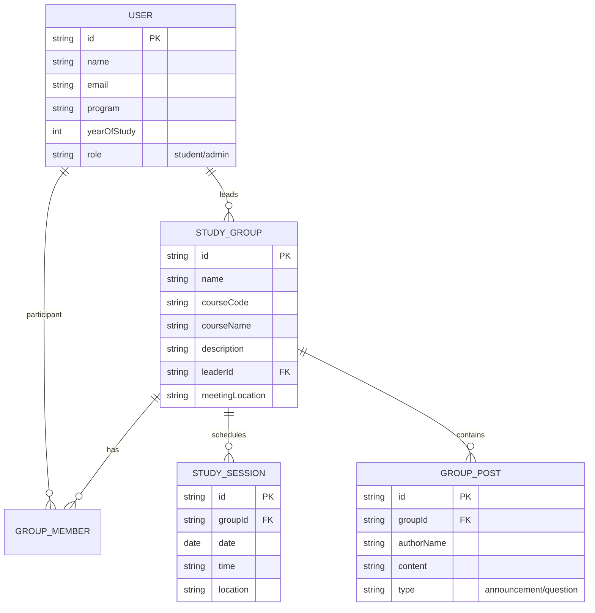

# Student Study Group Finder - System Report

**Course**: CSC1202 - Web & Mobile App Development  
**Institution**: Uganda Christian University (UCU)  
**Project Status**: Functional MVP  

---

## 1. Introduction

The **Student Study Group Finder** is a web-based platform designed to enhance collaborative learning within academic institutions. Students often struggle to find peers taking the same courses or to coordinate study sessions efficiently. This platform bridges that gap by allowing students to discover, join, and manage study groups based on their specific course enrollment and academic interests.

### 1.1 Objectives
- To provide a centralized hub for all campus study groups.
- To facilitate peer-to-peer learning through organized session scheduling.
- To improve academic performance by fostering collaborative environments.
- To provide administrators with analytics on student engagement.

---

## 2. System Requirements

### 2.1 Roles & Responsibilities

The system identifies three primary user roles, each with specific capabilities:

#### A. Students
- **Onboarding**: Secure registration and login.
- **Participation**: Ability to discover, create, and join study groups.
- **Persistence**: Access to a personal dashboard showing joined groups, upcoming sessions, and recent activity.
- **Engagement**: View upcoming study sessions and communicate via group posts/comments.

#### B. Group Leaders
- **Assignment**: Automatically assigned when a student creates a new study group.
- **Management**: Permission to edit group information and manage the member list (add/remove students).
- **Coordination**: Responsible for scheduling sessions (date, time, location, description).
- **Moderation**: Ability to moderate group communication and posts.

#### C. System Administrator
- **Operations**: Dedicated admin dashboard for platform-wide analytics.
- **Monitoring**: Track total registered users, total groups, and identify the most active courses.
- **Integrity**: Authority to remove inappropriate groups or posts to maintain system standards.

### 2.2 Functional Features

- **User Management**: Robust registration/login flow with JWT authentication and individual user profiles.
- **Group Management**: Full CRUD (Create, Read, Update, Delete) for groups, including member management and removal of inactive users.
- **Repository & Search**: A searchable repository of all groups, filterable by course code, faculty, or group title.
- **Session Scheduling**: Specialized coordination tool for leaders to broadcast meeting details to members.
- **Communication Hub**: Integrated messaging for announcements, peer questions, and group coordination.
- **Advanced Dashboards**:
    - **Student Dashboard**: Aggregates groups, sessions, and activity in a single view.
    - **Admin Dashboard**: Provides high-level system analytics and monitoring tools.

---

## 3. Technology Stack

The system is built using modern, industry-standard web technologies:

- **Frontend**: 
    - **React**: For building a dynamic and responsive user interface.
    - **Vite**: Ultra-fast build tool and development server.
    - **Tailwind CSS**: Utility-first CSS framework for modern styling.
    - **Shadcn UI**: High-quality UI components built on top of Radix UI.
- **Icons**: Lucide React.
- **Routing**: React Router DOM (v6+).
- **State Management**: TanStack Query (React Query) for data fetching and caching patterns.

---

## 4. System Architecture

The application follows a component-based architecture:

---

## 5. Database Schema

The system represents data using the following conceptual model (currently implemented via mock data objects for the MVP phase):

---

## 6. UI/UX Design

The platform prioritizes clarity and usability:
- **Responsive Design**: Fully optimized for mobile, tablet, and desktop views.
- **Aesthetic**: A professional, clean look using the Shadcn UI library.
- **User Flow**: Minimal clicks to reach core features (e.g., joining a group typically takes 2 clicks).

---

## 7. Conclusion

The Student Study Group Finder successfully creates a digital space for academic collaboration. By leveraging a high-performance frontend tech stack, the system provides a seamless user experience. Future iterations will focus on real-time chat integration and automated course syncing with university databases.

---
*Report generated on April 15, 2026*
